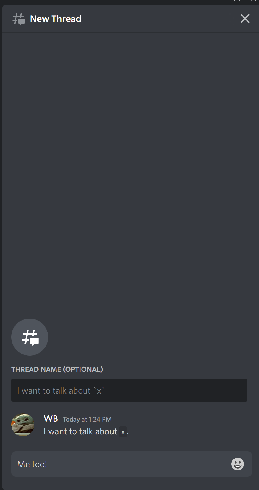

---
tags:
- "#🌱️" 
date: 07262022 - 13:13:49
---

# Using threads in discord

1. Someone has a topic to discuss.

2. Someone else wants to discuss it as well. 
- Hover over the message and click `Create Thread` then see this:

3. Conversations are archived automatically after a time period.

---
**Links**
- [[!Slipbox]]

## References
- https://support.discord.com/hc/tr/articles/4403205878423-Threads
