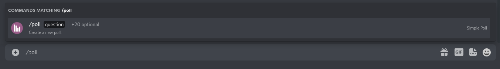
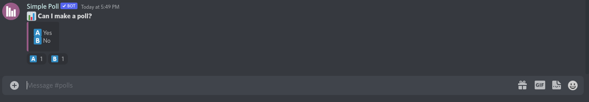

---
tags:
- "#🌱️"
date: 07262022 - 17:41:57
---

# How to make a poll with Simple Poll

1. Type `/poll`

2. Press `Tab` or select `question` on mobile.

3. Enter your question then press `Tab` or select a `choice_n` on mobile.

4. Enter your answer choices. Repeat step `3.` for multiple choices.

5. Press `Enter` and you now have a poll!

**Note:** Polls which have a binary response only require that you enter the question. 

The resulting poll answers are thumbs up/down. 

---
**Links**
- [[!Slipbox]]

## References
- 
